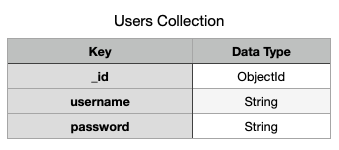
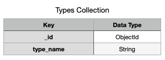
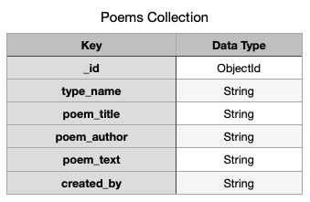

# **Poetry Cloud**

### About
* Poetry Cloud is a useful and accessible app for poets allowing the user to manage their poems in one convenient place.
* Unregistered users can search the database on the homepage to view poems by author, title or keywords. 
* Users can register and login to access their personal profile which lists only their poems.
* Once registered, users can add, view, edit and delete their poems as they choose.
* When adding new poems, users may select from a list of popular poetry types such as Haiku, Sonnet or Limerick, for example.
* An admin user can create, read, update and delete the poetry types themselves.

Link to website - https://poetry-cloud.herokuapp.com/get_poems

### User goals:
* To be able to store and manage poems in a convenient online location. 
* To be able to register an account and login to view their personal profile featuring poems they've added.
* To be able to add, view, edit and delete their poems. 
* To be able to share their work with a community of fellow authors and poetry fans.
* To be able to search the database and find work by fellow authors, by title of poem or keyword. 

### Business goals of the website:
* To provide a useful and convenient app for poets to store, share and manage their work.
* To promote poetry and encourage poets to develop a body of work and share it with their community.
* To enable users to contribute their own poems or share their favourite poems by other writers. 
* Build a minimal viable product to test the market and establish interest. 

## **UX**

The user types can be defined as one of the following:

* Amateur/professional poets.
* Poetry readers/fans.
* Publishers.
* Writers or bloggers of poetry. 

The site has been primarily designed to meet the needs of poets and poetry readers as they are the target audience. 

However, publishers and poetry bloggers have been kept in mind and would also benefit from using the app.

Clear sections which relate specifically to all of the user stories below are built into the website's design.

A mobile first approach was taken to create this project with consideration of ease of use and intuitive navigation to each of the features/sections. 

### **User Stories**

1. As a poet, I want to document my work so that I can be organised and have each item readily available. 
2. As a poet, I want to add/store my poems so that I can more easily manage them in the future. 
3. As a poet, I want to be able to edit and delete existing poems so that I can improve and update my collection.
4. As a poet, I want to be able to add new poems to existing types such as Haiku or Sonnet so that I can build a body of work. 
5. As a poet, I want to be able to view all of my poems in one place so that it’s easy to see and manage my work. 
6. As a poet, I want to be able to find a particular poem in my collection so that I can view, edit or delete it. 
7. As a poet, I want to be able to submit the title and text of my poems, so that I can add them to my collection and identify them later. 
8. As a poetry fan, I want to be able to submit poems by well known authors, so that I can store my favourites and share with the community. 
9. As a poet I want to be able to share my poems online with the poetry community and see the work of my fellow poets. 
10. As an administrator of the site, I want to be able to add, read, update and delete poetry types so that I can provide the best experience for the user. 

Further information and screenshots showing how this project meets the user's needs can be
found in the separate [TESTING.md](https://github.com/JohnW876/poetry_cloud/blob/master/TESTING.md) file.

### **Data design**

When designing the database for the app I stuck closely to the needs represented in the user stories. These user stories guided the creation of three separate collections of users, types and poems. The collections are shown here below in their field and value pairs. The data records are stored in MongoDB as BSON documents with unique id numbers.

* Users Collection - In order for users to manage a store of their own uploaded poems it was obvious that authentication and a personal profile would be a key feature of the app so therefore a user collection would be required to store the usernames and passwords of registered users.
* Admin user - I built an admin user into the app so that only they could control the poem types outlined below. 

* Types Collection - Users need to be able to add certain types of poem. Research showed 13 popular types so I decided to build those into a form with a selection dropdown for the users to choose from when adding or editing poems. These types would also need to be managed by an admin user with CRUD functionality. This required the creation of 13 documents in the database each represented by the diagram shown below.

* Poems Collection - When adding a poem to the database I designed the form to allow the user to first choose from the established list of poem type names. Then users can input the poem title, author and the text of the poem. Finally the database would store who the record was created by using the username. This would allow users to have full CRUD (Create, Read, Update and Delete) functionality and store poems in their own personal profile.

* Index - I created a text index on the poems collection to allow users to search the database for results based on fields relating to poem title, poem author or a word used in the poem text. 

### **Wireframe mockups:**
Below is a link to the project's wireframe mockups which were created using Balsamiq Wireframes software prior to development to help with visualisation of features and layout. 

https://github.com/JohnW876/poetry_cloud/tree/master/wireframes
 
Wireframe mockups were created for every page of the website at mobile, tablet and desktop sizes and I referred to them throughout development. 

### **User Expectations:**
* What will they expect to see? - Users will expect to see an intuitive app with accessible features and a well designed user interface. 

* Does the site look credible and trustworthy? - Many elements will contribute to the first impression of a trustworthy site. These include, clear and intuitive navigation, good design and functionality. 

* Does the site offer what the user wants? - The features will need to meet the user's goals whilst delivering expected functionality and a valuable user experience.

* Does the site seem valuable enough for users to stay and return? - The features, functionality, usability and design will need to meet or exceed expectations to provide the value needed to ensure continued usage.  
  

### **Market Research:**
* Online research shows a number of apps to help writers work on their technique and improve their writing skills.
* There are also a good number of apps that deliver work by famous poets in either spoken word or purely textual formats.
* However there are very few that allow any user, regardless of skill level, to contribute their own work to a community and to create their own collection and/or manage a store of their work. 
* This app aims to fill that gap in the market and be available to all poets as an accessible and useful tool to help develop their body of work.

### **Visual Design:**
* Colour scheme -
  When designing the site I wanted to convey themes relevant to poetry such as passion and human emotions. In colour psychology these themes closely align to red which suggests passion, danger, life and love. 
  Red is used consistently throughout the site in the key elements such as the brand logo, page headings, edit form buttons, form icons, nav mobile dropdown and the social footer background. 
  With red as such a dominant colour it would not help to introduce another strong colour but does balance in a classic scheme with black, white and grey and is suggestive of paper and ink colours and poetry writing.

* Imagery - I also wanted to think of the design from a poet's point of view giving an analogue writer's feel to the homepage with background images of paper textures. 
* This was also the reason I chose to use Materialize CSS to help build the site as I felt the Material Design ethos offered simplicity whilst being inspired by paper and ink and was appropriate for poetry.
* Typography - For the main body of the site including headings and navigation, the chosen font is Open Sans for clarity and legibility. I did consider a script type in reference to handwriting but wanted to keep the site looking modern and accessible and thought a script would look too old fashioned and stuffy!
* For the poem text I used 'pre' tags in html which helps with the problem of how to display poems with appropriate line breaks. The Courier font used with the poems allows the text to stand out and is more easy to read from a user's perspective. 
* The brand logo uses Averia Serif Libre font which is intended to be a warm and friendly rather than too stiff and formal. 
  
## **Features**

* The site has clear, simple and intuitive navigation.

* The site allows anyone to search the database for poems submitted by registered users.

* The site features authentication so that users can register an account with a username and password and safely login to their profile and view their submitted poems.

* Once logged in, users can add, edit or delete poems as they wish.

* A site administrator can login and manage the poem types. They can add, update or delete poem types as they wish. 

* The site is responsive to mobile, tablet and desktop screen sizes. 

* The footer contains links to social media websites and also to related poetry orgs and websites. 

### **Homepage**
There are a number of carefully chosen features on the homepage:

* Brand name and logo linking back to homepage.
* Site navigation links which are responsive and collapse into hamburger icon with side popout navbar on smaller devices.
* Navigation links are initially limited to 'Home', 'Login' and 'Register' and reveal further features once logged in.  
* Welcome header.
* Main feature headings on notepaper image background to convey the analogue theme. 
* Responsive images to complement the theme and design. 
* Search form to allow users to search the database of poems.
* A list of poems submitted by the community of registered users featuring pop out poems when clicked.
* If logged in, users may edit and delete poems they have submitted from both the home page and from their profile. 
* Responsive footer featuring social media icon links and useful links to poetry orgs and websites.

### **Register Page**
* A simple form allowing the user to create a username and password.
* The username has to be alphanumeric with between 5 and 15 characters in format for increased security. 
* Register button with styling and effects consistent with the Log In form.
* Link to Log In page if already registered.
* Flash messages display appropriately based on user input such as "You have successfully registered!" or "That username is already in use, please choose another."

### **Login Page**
* A simple login form which requires the user to enter their previously registered username and password.
* Once registered and logged in, further nav links reveal to 'Add Poem', 'Profile' and 'Log Out'.
* The login button on the form changes to outline the type in black on hover and makes use of material design waves effect when clicked.
* There is a link to the register page if the user has yet to register.
* A successful login displays the flash message "Welcome, username!" and redirects the user to their Profile page.

### **Profile Page**
* Once registered and logged in the user can visit their 'Profile' from the main navigation and view a list of their submitted poems by title and author.
* The username appears at the top of the profile page.
* When clicked, the poem pops out of the list and displays the poem type, the text of the poem itself and who submitted it.
* I have designed the data to allow differentiation between the author of each poem and who submitted it so that users could add either their own work or work created by others.
* Users are able to edit and delete poems from their profile page with the relevant buttons displayed next to each poem listed. 
* Clicking on the 'Edit' button opens a new page with an Edit Poem form.

### **Edit Poem**
* A simple form with dropdown selector and input sections allow the user to update an existing poem.
* Dropdown selector allows the user to select from one of thirteen poem types such as Sonnet, Haiku, Limerick etc. 
* With user inputs to add the poem's title and author.
* A text area to allow the text of the poem to be inputted. 
* Buttons at the bottom of the form allow the user to 'Cancel' the edit or to 'Update' the changes.

### **Add Poem Page**
* This key feature has a link in the main navigation at the top of the page.
* Users are able to add a new poem to their profile using a simple form. 
* All the input boxes are the same as the edit form above but there is a single add poem button. 

### **Manage Types Page (Admin user only)**
* Once logged in as an admin user the Manage Types page appears in the main navigation.
* There is an option button to add a new type at the top of the page.
* Existing types can also be edited or deleted using the buttons displayed.

### **Log Out**
* Once logged in the 'Log Out' link appears in the main navbar and when clicked the user is redirected to the log in page.
* Flash message displays appropriately, "You have successfully logged out"

### **Flash Messages**
* User friendly flash messages display on the screen to guide and inform the user at key events.

### **Features to implement in future**
When considering the trade off between importance and viability, the following features could not be implemented at this stage but would make valuable additions in future and improve the user experience.

* Image submissions - I would like to have allowed users the option of uploading and displaying images of their original writing to enhance the user experience but this wasn't a recommended option with MongoDB at the present time due to a number of issues.
* I would like to give registered users the option to either submit poems to the community or to keep their poems private. I would build this into the profile sections so that users can toggle this on and off as they wish.
* I think it would be great to add social share buttons to each poem listed to allow the user to quickly post their poems on their social pages.  

## **Languages Used** 
* HTML, CSS, Javascript and Python are used in this project.

## **Technologies Used**
* [Gitpod](https://www.gitpod.io/) Gitpod IDE was used to develop the website.
* [Materialize CSS](https://materializecss.com/) A Material Design framework used to make the website responsive on all devices.
* [FontAwesome](https://fontawesome.com/v4.7.0/) Icons were used in social links and forms. 
* [Google Fonts](https://fonts.google.com/) Font styles chosen for the website were sourced from here. 
* [Balsamiq Wireframes](https://balsamiq.com/) Used prior to commencing coding to help with UX/UI design and were consulted throughout development.
* [Chrome DevTools](https://developers.google.com/web/tools/chrome-devtools) To inspect the code, test the data and preview changes on all device sizes.
* [Heroku](https://www.heroku.com/) To deploy the site.
* [MongoDB Atlas](https://www.mongodb.com/cloud/atlas) To host and manage all data for the app. 

## **Testing**

Information regarding testing can be found in this separate [TESTING.md](https://github.com/JohnW876/poetry_cloud/blob/master/TESTING.md) file.

---
## **Deployment**

Poetry Cloud was developed with the Gitpod IDE and then pushed to a GitHub repository. The app is deployed via Heroku.

To deploy the app locally starting from GitHub:

**Git Clone**

1. Navigate to the github repository via this link - https://github.com/JohnW876/poetry_cloud
2. Click on the green dropdown labelled Code.

3. The box will display as below.

4. Copy the URL in the box to clone with HTTPS.
5. Open your preferred IDE (Integrated development environment).
6. Change the working directory to the location you want the cloned directory to be made.
7. Type git clone and paste the URL from step 4.
8. Press enter to create your local clone. 
9. In your IDE create an env.py file containing the following:

10. Ensure that you populate this with your "Secret Key", "Your Mongo URI" and "Your MongoDB Name"
11. Finally, make sure to add env.py to your .gitignore file.

**To Deploy Using Heroku**

1. Type the folowing command in the terminal - **pip freeze > requirements.txt**
2. This creates a requirements.txt file
3. Now create a Procfile using the terminal command -  **echo web: python app.py > Procfile**
4. Add and commit the requirements file and Procfile and then git push to GitHub.
5. Now go to [Heroku](https://id.heroku.com/login) and log in.
6. From your dashboard in Heroku, click on the 'New' button as shown below and select Create new app.

7. Give the app a name, select your region and then click create app.

8. From the dashboard of the new app, under the Deploy tab, next to Deployment Method, select Github - Connnect to Github.

9. Below in the Connect To Github section, search for the correct repository and then connect.

10. In the dashboard of the app under 'Settings', click  'Reveal Config Vars'

11. Input the same values in Config Vars as those stored in the env.py file.

12. In the 'Deploy' tab choose a branch to deploy and click 'Enable Automatic Deploys' Once enabled, it will look like this:

13. Click open app at the top of the page to view the newly deployed app. 

---

## **Credits**

### **Content**
All site content, except for example poems, was written by John Withey.

### **Media**
All images used in this project were created by the talented photographers at Unsplash.
https://unsplash.com/ 

### **Code**
I borrowed code from the Code Institute's Task Manager Mini Project and appropriated to help with building CRUD functions, search and authentication functionality.
* https://www.youtube.com/watch?v=y72Dq3GRxhc&feature=youtu.be

Form validation for select dropdown. Source code copied from Code Institute Mini Project.
* https://github.com/Code-Institute-Solutions/TaskManagerAuth/blob/main/04-AddingATask-WritingToTheDatabase/02-materialize-select-validation/static/js/script.js 

I used this code from Stack Overflow to change the default colour of the select options dropdown in my forms.
* https://stackoverflow.com/questions/54727612/materialize-css-dynamically-change-the-background-and-text-color-of-the-select

I used this code from Stack Overflow to help create responsive pre tags.
* https://stackoverflow.com/questions/34691470/responsive-pre-tag

From Materialize CSS I added code to help build my forms and collapsible popout lists.
* https://materializecss.com/

### **Acknowledgements**
Poetry can often be seen as stuffy and a bit inaccessible. I wanted, to create an app that let's anyone have a go and share it with a community of like minded people. 
On this app you can write anything you like as a Free Verse poem or be more specific and write a Sonnet if you want! 
It's a simple app for aspiring poets or even more established ones but hopefully it's a useful one that people will enjoy and find accessible. 

I'd like to thank my mentor Aaron Sinnott, once again, for helping with positive and constructive feedback during the project! 

 